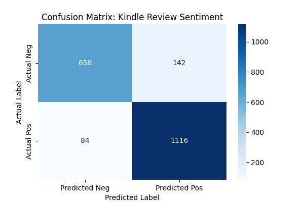

# Kindle Book Review Sentiment Analysis Project

This repository contains a machine learning project focuses on sentiment analysis of Kindle book reviews. The goal is to build a classification model that can accurately determine whether a review has a positive or negative sentiment.

# Project Goal

The primary objective is to develop a robust sentiment analysis model that can classify book reviews as either positive or negative, using a dataset of Kindle reviews from Amazon.

# Dataset

The dataset used for this project is the **Kindle Book Review dataset**, which is publicly available and contains a large number of reviews, each with a star rating and the full text of the review.

* **Source: [Kaggle - Amazon Kindly Book Review for Sentiment Analysis](https://www.kaggle.com/datasets/meetnagadia/amazon-kindle-book-review-for-sentiment-analysis)

# Project Structure

* Book_Review_Sentiment
  * data/
    * raw/
      * all_kindle_reviews.csv
    * processed/
      * all_kindle_reviews_processed.csv
    * images/
    * book_review_sentiment.ipynb
    * README.md
    * requirements.txt
    * .gitignore

# Initial Data Overview

The dataset consists of 12,000 Kindle book reviews. A quick exploration of the data has revealed the following key characteristics:

- Columns: The dataset has 11 columns in total, of which are of most interest to this project are `rating` and `reviewText`.
- Data Integrity: The `reviewText` column has no missing values, and there are no duplicate entries in the dataset.
- Rating Distribution: The ratings are perfectly balanced, with 2,000 reviews for each star rating of 1 to 5. This is an ideal scenario for a classification task as it avoids issues related to class imbalance.

# How to Run This Project

1. **Clone the repository:**
   ```bash
   git clone https://github.com/lorettayong/Book-Review-Sentiment.git
   cd book-review-sentiment
   ```
2. **Set up the virtual environment:**
   ```bash
   python -m venv venv
   source venv/bin/activate
   # On Windows, use '.venv\Scripts\activate'
   ```

3. **Install dependencies:**
   ```bash
   pip install -r requirements.txt
   ```

4. **Download NLTK data:**
   * In a Python interpreter or script, run the following commands to download the necessary NLTK data:
     ```bash
     import nltk
     nltk.download('punkt')
     nltk.download('stopwords')
     nltk.download('wordnet')
     ```

5. **Run the Jupyter notebook:**
   ```bash
   jupyter notebook
   ```
   * Open `book_review_sentiment.ipynb` in your browser to follow the project's analysis steps.

# Project Phases

## Phase 1: Data Acquisition and Exploration
* **Objective:** Understand the raw data's characteristics, quality, and distribution before carrying out data transformation.
* **Key Activities:**
  * Loaded 'all_kindle_reviews.csv' dataset into a pandas DataFrame.
  * Performed an initial inspection to understand the data's structure, identify any missing values, and check for duplicates.
  * Conducted a simple exploratory data analysis to visualise the distribution of star ratings, confirming that the dataset is well-balanced.

## Phase 2: Data Preprocessing and Feature Engineering
* **Objective:** Transform raw text into a clean, numerical format suitable for machine learning.
* **Key Activities:**
  * Converted 5-star ratings into binary labels (1 for Positive, 0 for Negative) and removed neutral 3-star reviews to reduce noise.
  * Used Regex to lowercase text and remove URLs, HTML tags, punctuations and numbers.
  * Tokenised reviews, removed English stop words, and applied WordNetLemmatizer to reduce words to their base forms e.g. "reading" to "read".
  * Implemented TF-IDF (Term Frequency-Inverse Document Frequency) to convert text into a matrix of 5,000 features.
  * Divided the dataset into training (80%) and testing (20%) sets using stratified sampling to maintain class balance.

## Phase 3: Model Building and Evaluation
* **Objective:** Train a classifier and assess its performance.
* **Key Activities:**
  * Selected Logistic Regression, a robust algorithm for high-dimensional text data, as the model to train.
  * Fitted the model on the training set, `X_train` and `y_train`.
  * Assessed the model's performance by using key metrics such as accuracy, precision and recall.

**Model Performance Evaluation:**
  * Performance matrics
    * Overall accuracy: 88.70%
    * Weighted F1-score: 88.62%
  * Detailed classification report: The model demonstrates strong predictive power across both Negative and Positive classes.

| Class    | Precision | Recall | F1-Score |
|:---------|:----------|:-------|----------|
| Negative | 0.89      | 0.82   | 0.85     |
| Positive | 0.89      | 0.93   | 0.91     |



  * Key observations:
    * The model has a high positive recall since it successfully identified 93% of all positive reviews in the test set.
    * The confusion matrix revealed 142 False Positives and 84 False Negatives. The higher number of False Positives suggests that the model is slightly more prone to misclassifying negative sentiment as positive. This could be due to "sarcasm" or "mixed reviews" whereby a user's choice to words tend to be positive while describing a negative experience. 

# Next Steps (Future Work)

* ~~**Data Preprocessing and Feature Engineering:** Transform the raw text data into a clean, more structured format that is suitable for machine learning models using sentiment mapping, text cleaning, text normalisation, vectorisation, and data splitting.~~
* ~~**Model Building and Evaluation:** Train a machine learning model, such as Logistic Regression or Support Vector Machine (SVM), on the prepared training data, and assess its performance on unseen data using key metrics like accuracy, precision, recall, and F1-score.~~
* **Model Optimisation and Deployment:** Improve the model's performance by using techniques such as hyperparameter tuning and cross-validation, and prepare it for real-world use by creating a new branch on Github to work on developing a simple web application.
